# Available feature intro of ECMAScript 6

> 关于*ECMAScript 6*可用的新特性简介

### ECMAScript 6简介
ECMAScript 6（以下简称ES6）是JavaScript语言的下一代标准，已在2015年6月正式发布了。
ES6的目标，是使得JavaScript语言可以用来编写大型的复杂的应用程序，成为企业级开发语言。

### ECMAScript和JavaScript的关系
ECMAScript是JavaScript语言的国际标准，JavaScript是ECMAScript的实现。

### 安装编译环境
我使用了 [BabelJS] ES6转译器。
安装方法如下:

	$ npm install --save-dev gulp-babel

基于[generator-gulp]工作流的基础上。
只需要新增的配置如下:

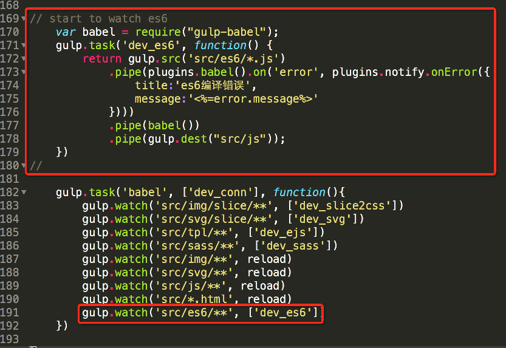

运行方法如下:

    $ gulp babel

### 关于代码环境的介绍
有一部分ES6的新特性通过 [BabelJS] 转译后，可以在ie7上运行。
而需要依赖ES5环境的新特性只能在ie9上运行，ie7/8需要部署ES5环境。
因此我把ES6的新特性分为以下三类来进行介绍。

纯净版的代码:

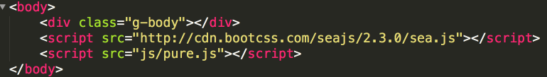

部署ES5环境的代码:

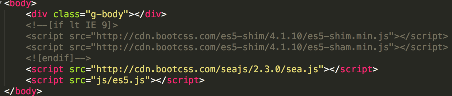

部署ES6环境的代码:

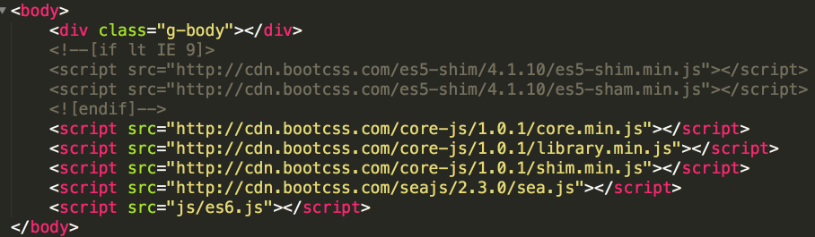

ES6的新API很多，如果不部署ES6环境，均不能使用。
这次简介我会着重介绍新语法方面。

### let命令
let的用法类似于var，但是所声明的变量，只在let命令所在的代码块内有效。

转译前:

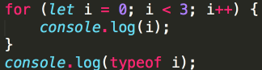

转译后:

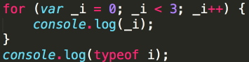

转译前:

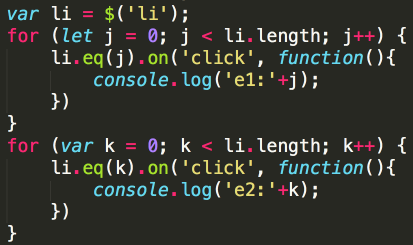

转译后:

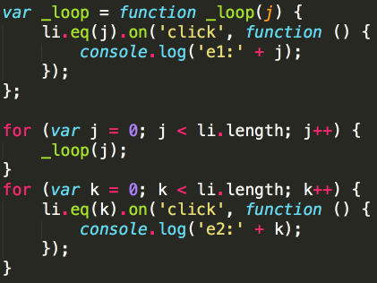

IE7下依次点击3个li标签:

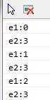

### 模板字符串
模板字符串（template string）是增强版的字符串，用反引号（`）标识。
模板字符串中允许嵌入变量或者表达式，只需要写在${}之中即可。

转译前:

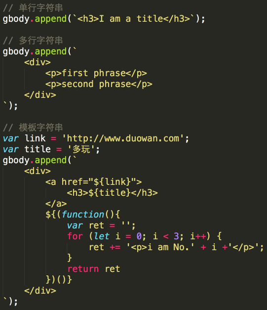

转译后:

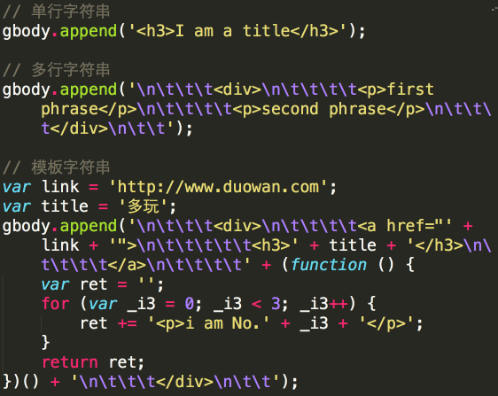

### 属性简洁表示法
ES6允许直接写入变量和函数，作为对象的属性和方法。这种写法用于函数的返回值，将会非常方便。

转译前:

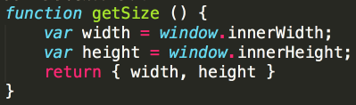

转译后:

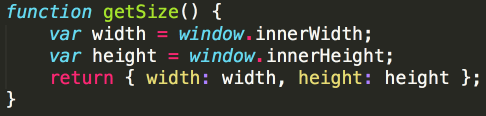

### 函数参数默认值
ES6允许为函数的参数设置默认值，即直接写在参数定义的后面。

转译前:

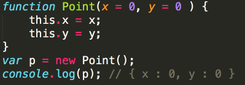

转译后:

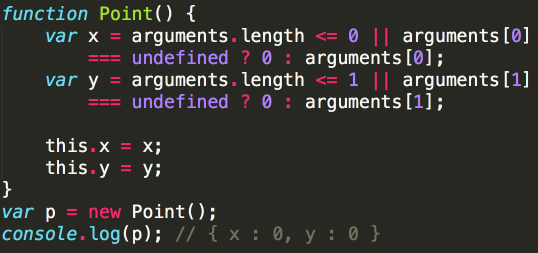

### rest参数
rest参数（形式为“...变量名”）用于获取函数的多余参数。
rest参数之后不能再有其他参数。

转译前:

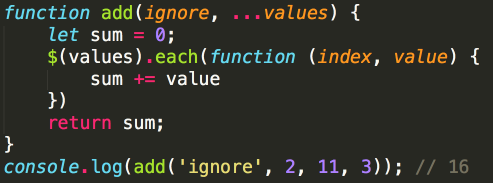

转译后:

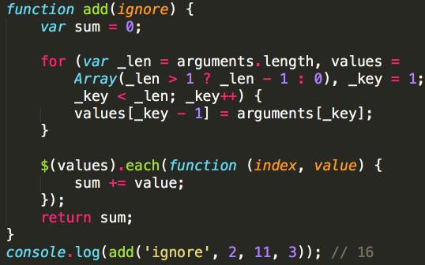

### 扩展运算符
扩展运算符（spread）是三个点（...）。
该运算符将一个数组，变为参数序列。

转译前:

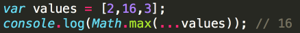

转译后:

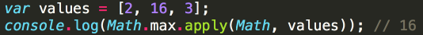

### 箭头函数
ES6允许使用“箭头”（=>）定义函数。

转译前:

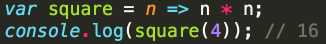

转译后:

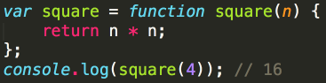

但是箭头函数有几个要注意的问题:
1. 函数体内的this对象，绑定定义时所在的对象，而不是使用时所在的对象。
2. 不可以当作构造函数，也就是说，不可以使用new命令，否则会抛出一个错误。
3. 不可以使用arguments对象，该对象在函数体内不存在。

转译前:

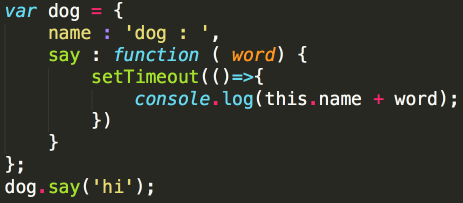

转译后:

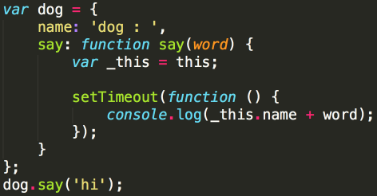

### 数组/对象的解构赋值（需部署ES5环境）
ES6允许按照一定模式，从数组和对象中提取值，对变量进行赋值，这被称为解构（Destructuring）。

转译前:

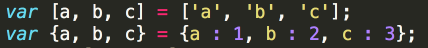

转译后:

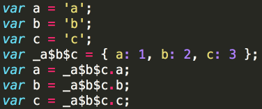
解构赋值对提取JSON对象中的数据，尤其有用。

转译前:

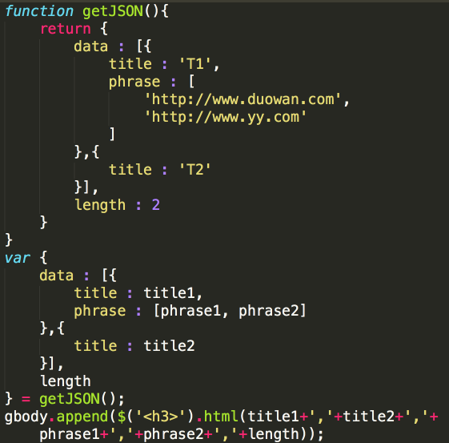

转译后:

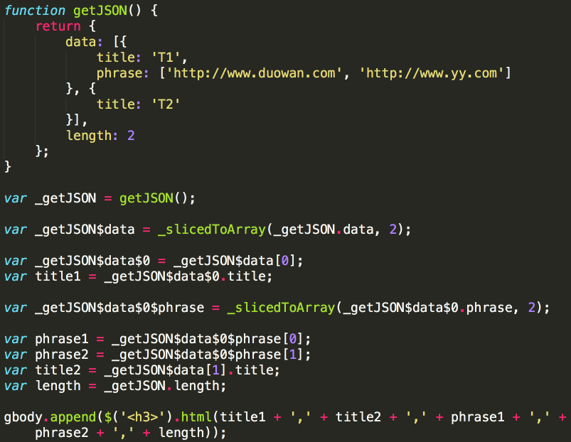

IE7下变量赋值成功:

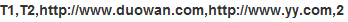

### 标签模板（需部署ES5环境）
模板字符串可以紧跟在一个函数名后面，该函数将被调用来处理这个模板字符串。这被称为“标签模板”功能（tagged template）。

转译前:

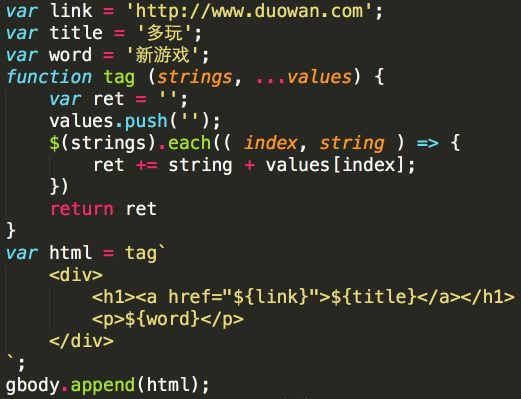

转译后:

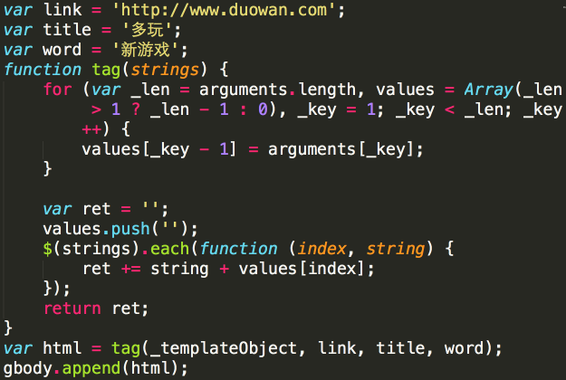

<!-- 需部署ES6环境下使用的特性，不仅要引入数个js，还因为转译而生成若干函数，对于代码的侵入性已经非常强了。因为代码被大部分重写了，所以看转译的代码没什么意义，我们直接看源码吧。我挑了两个如果部署ES6环境的话，最高概率使用的两个新特性。 -->

### for...of循环（需部署ES6环境）
ES6中引入了for...of循环，作为遍历所有数据结构的统一的方法。
for...of循环可以使用的范围包括数组、Set和Map结构、某些类似数组的对象（比如arguments对象、DOM NodeList对象）、Generator对象，以及字符串。

数组的循环:

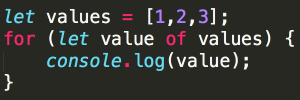

Map结构的循环:

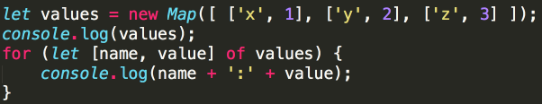

Chrome下运行结果:

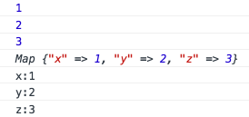

IE7下运行结果:

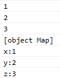

### 构造函数Class（需部署ES6环境）
ES6提供了更接近传统语言的写法，引入了Class（类）这个概念，作为对象的模板。
constructor方法是类的默认方法，通过new命令生成对象实例时，自动调用该方法。
Class只能通过使用new命令来生成实例对象，调用将会报错。
Class之间可以通过extends关键字，实现继承。
使用super关键字指代父类的实例（即父类的this对象）。

源码:

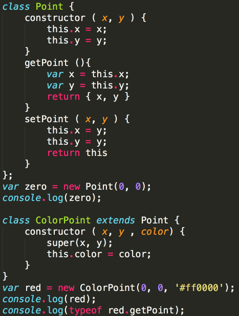

Chrome下运行结果:

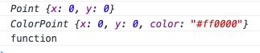

### 结语
国内主流浏览器都是基于国外浏览器内核上进行封装，而且基本不会采用最新的内核版本。
即使有能全面兼容ES6的新一代浏览器，我们的代码也不能不向下兼容，照顾庞大的用户人群。
个人觉得这次对ES6的归纳总结的主要意义在于，通过检查转译器生成的代码的兼容性，可以判断出哪些新特性新语法可以通过转译的形式，在ES5下完美兼容。
先慢慢适应部分新语法，等ES6真的成为主流时，就能良好地过渡过去。

<!-- 然而转译器也不能百分比地认为可靠...
即使我把部分我认为'安全'的语法过滤出来了...
也不排除在特定的上下文下转译成错误的逻辑代码...
我感觉我就是在挖坑... -->

### 参考链接
BabelJS : http://babeljs.io/

ECMAScript 6 入门 : http://es6.ruanyifeng.com/

ES6的部署进度 : http://kangax.github.io/es5-compat-table/es6/

---
[BabelJS]: http://babeljs.io/
[generator-gulp]: https://github.com/duowan/generator-lego
