# 用Promise打开新世界的大门


## 异步编程

`JavaScript`是在单线程环境下执行的语言，异步编程是每一位开发者都必须掌握的技能。

异步编程的方法，有如下几种：

* Callbacks
* Listeners
* Promises (ES6)
* Generators (ES6)
* Async Functions (ES7)

[@see async-javascript](https://github.com/vasanthk/async-javascript)

`Callbacks`跟`Listeners`我们都很熟悉了。

````
setTimeout(function(){
    // some code
}, 100);

$.ajax({
    url : myUrl,
    success : myCallback
});

document.addEventListener('click', function(){
    // some code
}, false);

$(myButton).on('click', myClickHandler);
````

<!-- 发布订阅模式(Publish Subscribe Pattern) -->
<!-- 观察者模式(Observer Pattern) -->

## Promise的诞生

<style type="text/css">
    .markdown-body input {
        font-size: inherit;
        cursor: pointer;
    }
</style>

`Callbacks`跟`Listeners`已经可以为我们解决很多问题了，为何还需要`Promise`。<input data-trigger="hell" type="button" value="Why?">

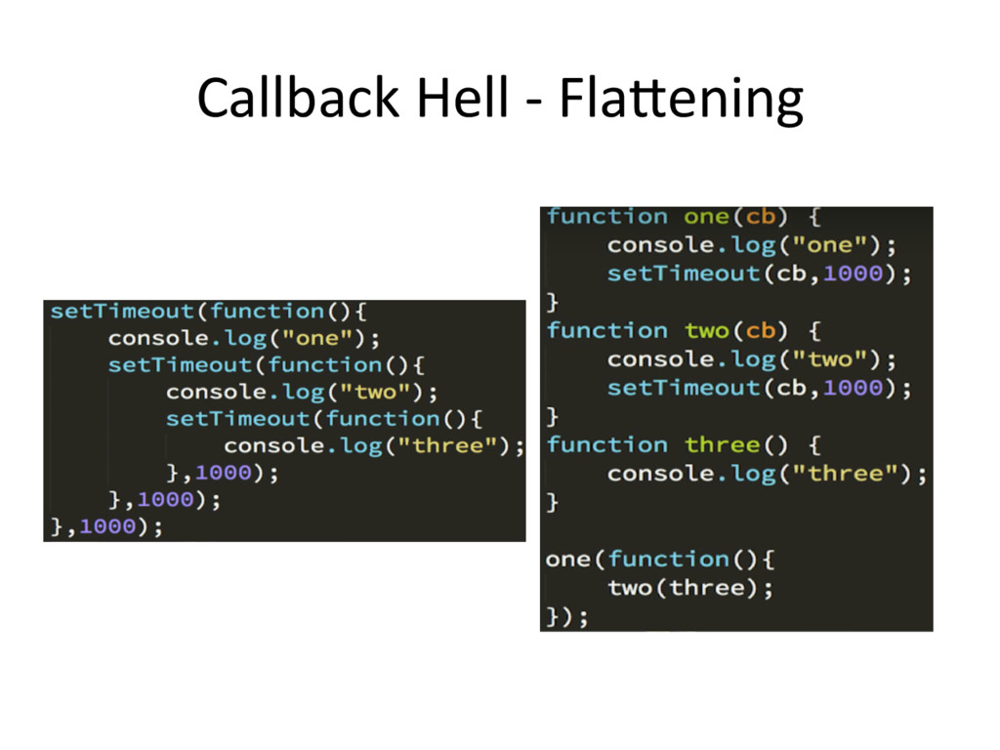

<script type="text/javascript">
(function(){
    this.style.visibility = 'hidden';
    document.querySelector('input[data-trigger="hell"]').addEventListener('click', () => {
        this.style.visibility = 'visible';
    }, false);
}).call(document.querySelector('img[alt="hell"]'));
</script>

解决以上问题，也是使用`Promise`的目的之一。

`Promise`是异步编程的一种解决方案，它用状态来表示一个异步操作（也可以是同步）的`结果`。我们使用这个`结果`来组织我们异步的代码。

除了`JavaScript`也有其他语言，使用`Promise`。


一些开源的库，例如`jQuery`，也实现了自己的`Promise`。

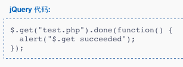


大家的实现方法，其实并不一样。比如接口也会存在差异。因此我们就需要统一的规范。

Promises/A+是一种异步编程规范，es6部署的`Promise`是遵循这种规范的。


[@see Promises/A+](https://promisesaplus.com/)

[@see Promises/A+(中文版)](http://www.ituring.com.cn/article/66566)

说了那么多，只是交代了一下`Promise`诞生的背景。

## Promise的特点与状态

1）对象的状态不受外界影响。
2）一旦状态改变，就不会再变，任何时候都可以得到这个结果。

这两个特点是怎么理解的呢？这里我们要引入3个状态描述词。

* pending
* fulfilled
* rejected

---

等待态（Pending）

处于等待态时，`Promise`需满足以下条件：

* 可以迁移至执行态或拒绝态

---

执行态（Fulfilled）

处于执行态时，`Promise`需满足以下条件：

* 不能迁移至其他任何状态
* 必须拥有一个不可变的终值

---

拒绝态（Rejected）

处于拒绝态时，`Promise`需满足以下条件：

* 不能迁移至其他任何状态
* 必须拥有一个不可变的据因

---

我们用流程图表示，其实就是，这么一回事。

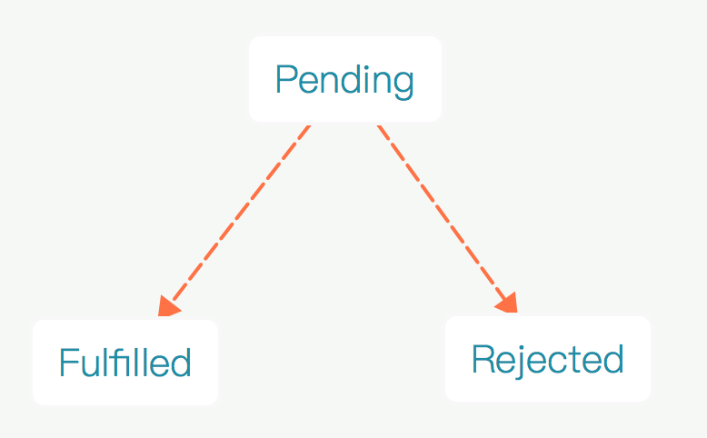

`Promise`的实例接收一个参数，类型必须为函数。而这个函数会立即执行。

````
console.log('step1');
new Promise((resolve, reject) => {
    console.log('step2');
});
console.log('step3');
````

这个函数，接收两个方法，第一个方法是`resolve`，第二个方法是`reject`。

调用`resolve`会将这个`Promise`实例的状态迁移至`Fulfilled`，传递的第一个参数将成为终值。

调用`reject`会将这个`Promise`实例的状态迁移至`Rejected`，传递的第一个参数将成为据因。

1）对象的状态不受外界影响。
2）一旦状态改变，就不会再变，任何时候都可以得到这个结果。

因为这两个方法是在这个函数内部调用的，所以对象的状态不受外界影响。

## Then方法

`then`是`Promise`实例都可以调用的方法。

````
promise.then(onFulfilled, onRejected)
````


`then`方法都是异步的。

````
new Promise((resolve, reject) => {
    resolve();
}).then(() => {
    console.log('%cFulfilled', 'color:green');
}, () => {
    console.log('%cRejected', 'color:red');
});
console.log('%csome code', 'color:blue');
````

## Promise的解决过程

`then`方法都是可以链式调用的。

````
var mock = new Promise((resolve, reject) => {
    var data = {
        name : 'lxl',
        image : 'http://ued.yypm.com/50x50'
    };
    resolve(data);
});

// some code

mock.then((result) => {
    var { name, image } = result;
    console.log(name);
    // some code
}).then(() => {
    console.log('step 2');
    // some code
}).then(() => {
    console.log('step 3');
    // some code
});
````

`then`方法链式调用时，返回值都会成为下一个`then`的参数。

````
var sleep = (delay) => new Promise((resolve, reject) => setTimeout(resolve, delay));

// some code

sleep(100)
    .then(() => 0)
    .then((x) => x + 9)
    .then((y) => y + '9')
    .then((z) => console.log(z));
````

`then`返回的是一个`Promise`的实例，那么下一个`then`将等待这个`Promise`的实例发生状态迁移。

#### 这个特性非常有趣。<input data-trigger="then" type="button" value="show">

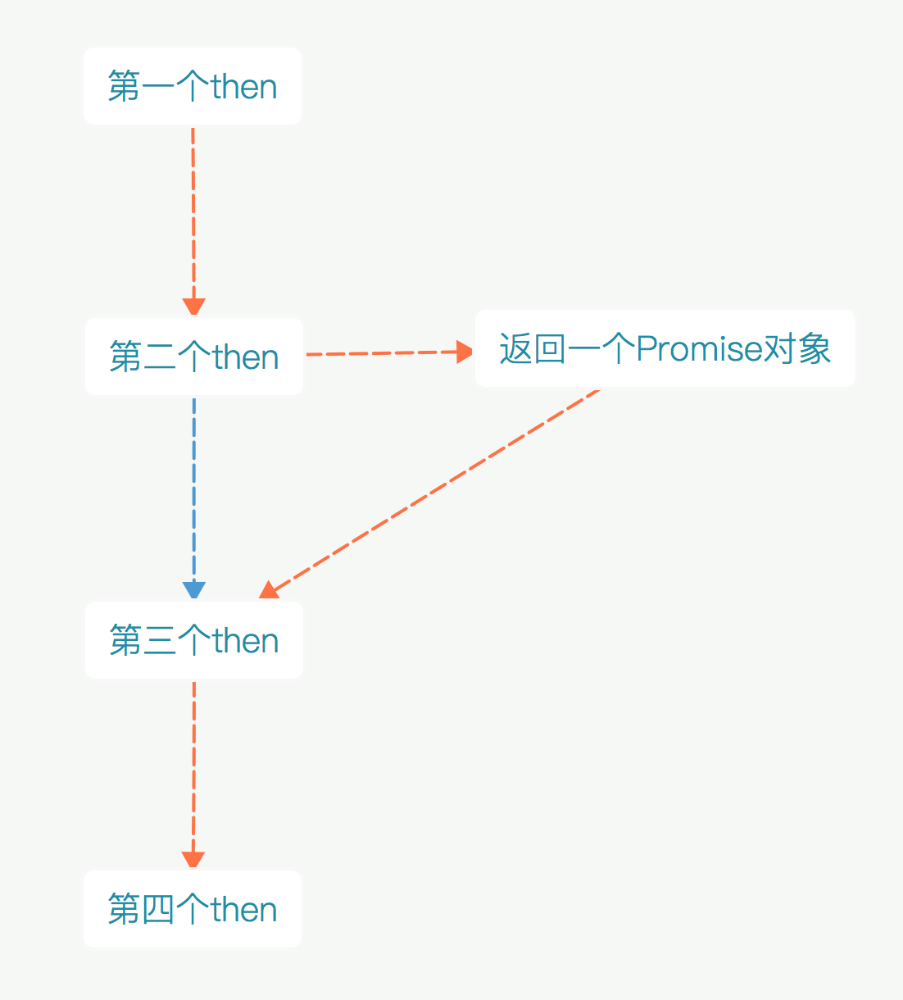

<script type="text/javascript">
(function(){
    this.style.display = 'none';
    document.querySelector('input[data-trigger="then"]').addEventListener('click', () => {
        this.style.display = 'block';
    }, false);
}).call(document.querySelector('img[alt="then"]'));
</script>

````
var sleep = (delay) => new Promise((resolve, reject) => setTimeout(resolve, delay));

// some code

sleep(100)
    .then(() => console.log('开始第一步动画'))
    .then(() => sleep(2000))
    .then(() => console.log('动画用时2秒，开始第二步动画'));
````

#### 有没有觉得非常符合人的思考方式呢？

## 更复杂的逻辑

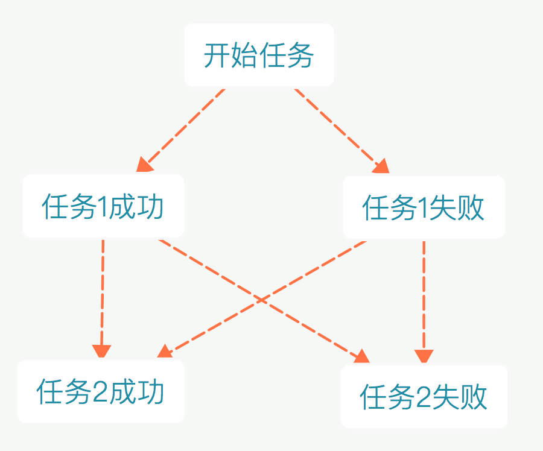

````
var task = (condition) => new Promise((resolve, reject) => condition == 'error' ? reject() : resolve());
var task1 = task('error').then(() => {
    console.log('task1 is success');
    return task('error')
}, () => {
    console.log('task1 is error');
    return task('success')
});
var task2 = task1.then(() => {
    console.log('task2 is success');
}, () => {
    console.log('task2 is error');
});
````

## 更多实用方法

掌握了`then`的秘密，那么你的`Promise`就已经能出山了。

不过，我这里再补充两个，非常实用的方法。

* catch
* Promise.all

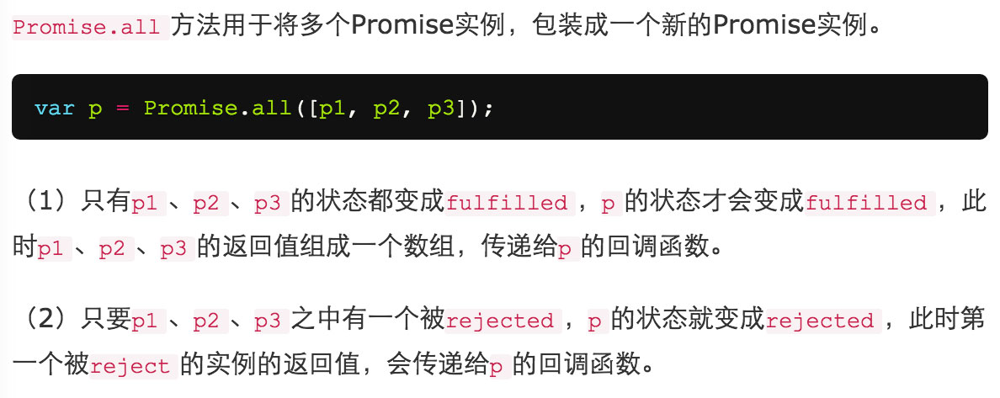

`promise.catch(onRejected)`类似`promise.then(null, onRejected)`的shortcut。

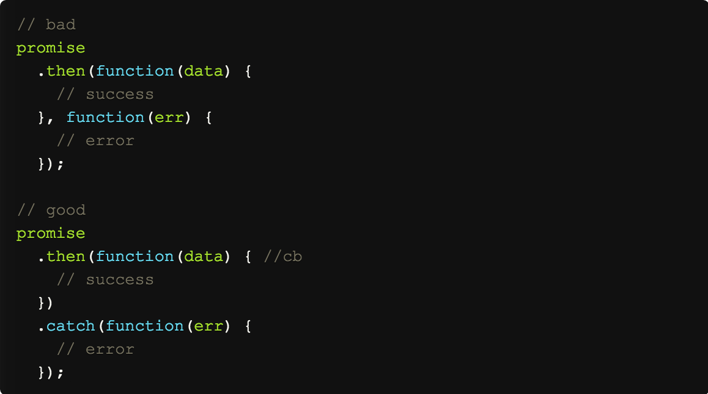


## 情景分析

长久以来有几个问题困扰着我们。

1. 有的时候，我们没办法，知道这段代码将会是，异步还是同步执行，例如jQuery.ready。

2. 当我们需要依赖的事情是两个以上，一般情况下，我们会再写代码进行判断。

3. 发出一个ajax请求的时候，必须将`success`跟`error`的function定义好。

4. 当一个ajax请求，需要在另一个ajax的请求成功后才执行，回调嵌套的噩梦就开始了。

这是问题1的例子。

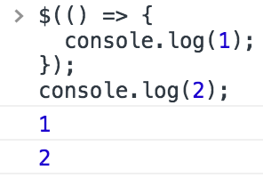

这是问题2的例子。

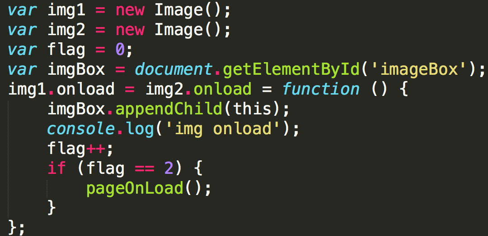

`康熙一期`


对于问题3。

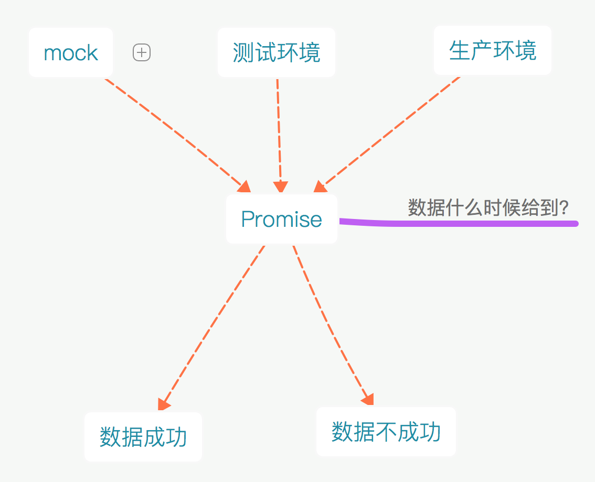

`康熙一期`

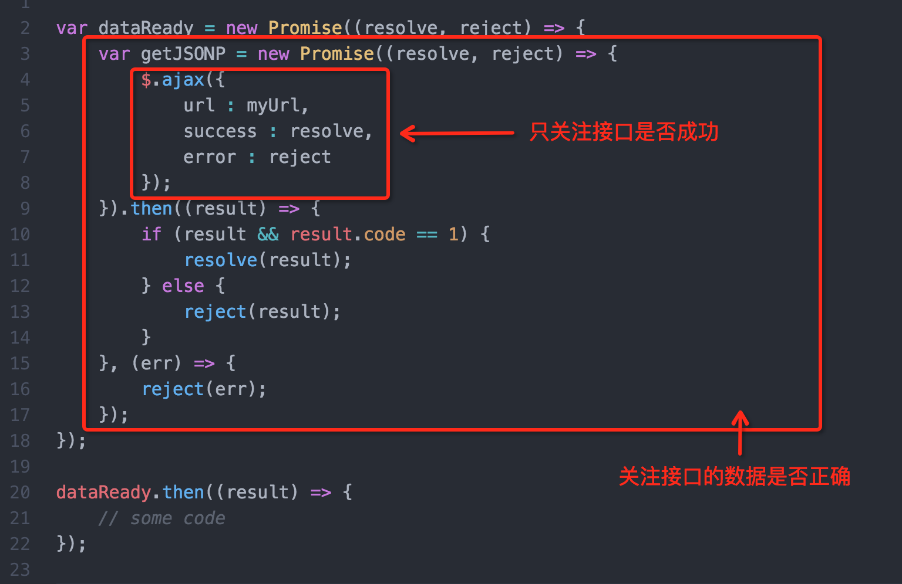

`康熙一期`的流程图。

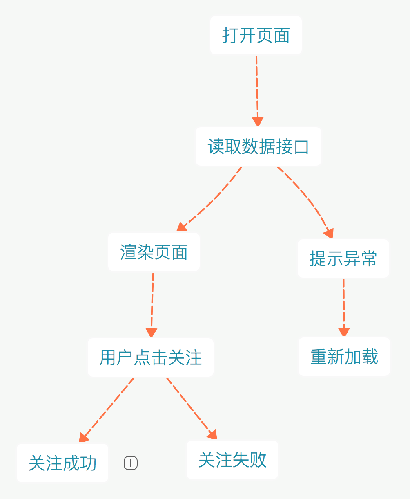

## 快速开始

#### Web

````
// 引入 promise
var { Promise } = require('./lego-lib/es6-promise/3.2.1/es6-promise.js');
````

#### Nodejs

Node 4.0 支持es6 与 Promise

[@see promisify](https://mp.weixin.qq.com/s?__biz=MzA4NjE3MDg4OQ==&mid=2650963217&idx=1&sn=242efadbfe1964e9c04865ba32356afb&scene=1&srcid=0419cXRhv9Mwwd72p4AGQMgp&key=b28b03434249256be7c49a4532995cdb3dac61e7b28d8fbed753e3eeb6193eb67efd1badc2d0c2ec3a358c31609840a7&ascene=0&uin=MjA1ODk2NDI0MA%3D%3D&devicetype=iMac+MacBookPro12%2C1+OSX+OSX+10.11.3+build(15D21)&version=11020201&pass_ticket=I7GmJ2rqKEv0SCQMZwZ8IOT2bMfd1UVaNUt9vMG64yrl7RQzmbEdm9qpgbt5Fq%2BK)


